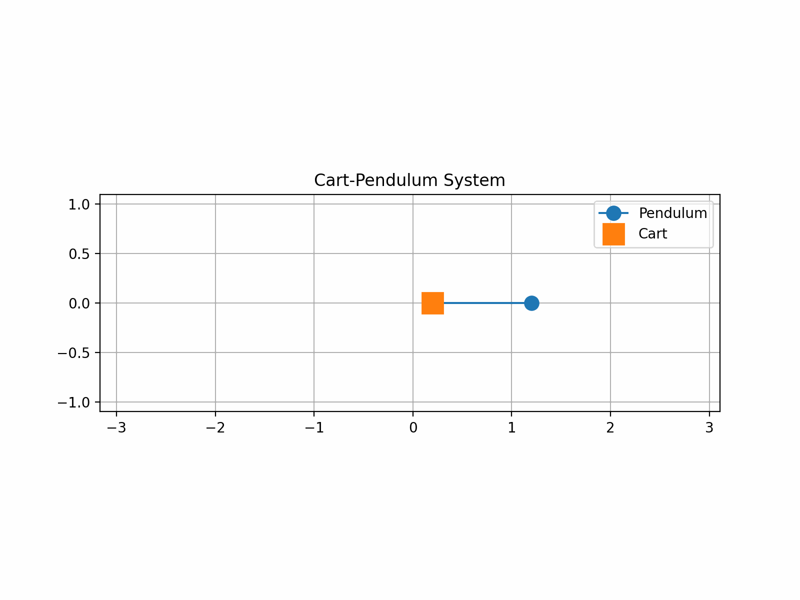

# Springed Cart and Pendulum

This project is a part of PHYS111: Theoretical Mechanics at Harvey Mudd College. We aim to simulate a springed cart and pendulum system using Euler-Lagrange approach. The simulation includes an animation that visualizes the motion dynamics.

## Features
- Simulation of a springed cart and pendulum system
- Animated visualization of the motion
- Implemented using Python and relevant numerical methods
